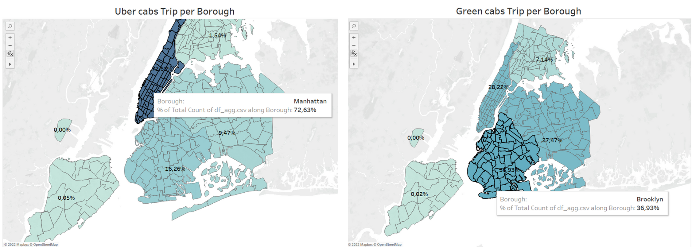

## **Uber vs Green Cabs Trip in New York City - an Analysis**

*You can visit this project dashboard [here](https://public.tableau.com/views/UbervsGreenCabsTripinNewYorkCity/Dashboard1?:language=en-US&publish=yes&:display_count=n&:origin=viz_share_link) 

**Dataset**

[Uber](https://www.kaggle.com/datasets/fivethirtyeight/uber-pickups-in-new-york-city?select=uber-raw-data-janjune-15.csv) 

[Green Taxi](https://www.nyc.gov/site/tlc/about/tlc-trip-record-data.page)

[New York Shape File](https://maps.princeton.edu/catalog/nyu-2451-36743)

## Introduction
In August 2013, the New York City Taxi and Limousine Commission (NYCTLC) introduced Green Cabs in the New York City area aimed at residents outside Manhattan with the consideration that Yellow Cabs tend to be low in the area. Green Cabs themselves are designed to be ordered by passengers via telephone or online.
In May 2011, Uber expanded to the New York City area. Research shows that Uber has replaced rides in Yellow Cabs in downtown NYC and supplemented rides with Green Cabs outside of NYC. As such, Green Cabs have faced fierce competition from Uber since its introduction, with Uber offering lower fares and easier accessibility through its mobile app.

## Goals
Analyzing the performance of Green Cabs and Uber Taxi through visual analysis of passenger trips using Green Cabs and Uber Taxi from January to June in 2015 in the New York City area
Broadly speaking, there are two questions related to the research conducted:
* How do Green Cabs and Uber rides compare regionally in neighborhoods outside of New York City?
* Do customer preferences change according to the time of day (night/day or weekend/weekday)?

## Methodology

### Data Acquisition
There are two datasets used
* NYCLTC : Is part of the New York OpenData project. This project uses trip record data for the period January to June 2015 with a total of around 10 million trip data.
* Uber dataset: taken from the website fivethirtyeight.com. The dataset contains 14 million trip data from January to June 2015.

Besides that, we also need zip code polygon data to be able to visualize the dataset into a chloropeth map.

### Data Preprocessing
The Pre-processing stage consists of three main steps:
1) Import NYC postal codes into the database.
2) Import raw CSV travel data into database.
3) Aggregate the variables in the Green cabs and Uber datasets.

### Aggregation Process

## Result

### Meaningful Fact

**Meaningful Fact #1**

Uber is more popular than Green cabs both on weekends and weekdays. Judging from the distribution of trips according to the comparison of weekends versus weekdays, Uber seems to really dominate

**Meaningful Fact #2**

The average number of trips per hour for Green cabs on weekends has increased by 25% compared to weekdays, while Uber has increased by 7%. Here Green cabs shows an 18% increase in orders compared to Uber on weekends.

**Meaningful Fact #3**

From the chloropeth map above, it can be seen that the distribution of Uber use is not as evenly distributed as Green cabs. About 72% of total Uber trips are from the Manhattan area. Meanwhile, Green cabs have a fairly spread distribution, especially in the three main areas (Manhattan, Brooklyn and Queens).

**Meaningful Fact #4**

Based on market share, since the beginning of the year Uber has succeeded in beating Green cabs as the market leader, where the numbers have continued to increase significantly from month to month, until its peak in June, Uber controlled 63% of the market. 

**Meaningful Fact #5**

The graph of demand for taxis from hour to hour for both Green cabs and Uber is very similar, but from midnight to morning the demand for Uber taxis has decreased more sharply than Green cabs.

### Actionable Insight

1) **Continue Doing More**

Investing in technology is something that needs to be done, given the rapid development of Uber, of course it cannot be separated from the role of technology.

2) **Do Differently**

LPEPs must add an attribute to their dataset, which contains a postal code or other predefined area of a particular trip

3) **Start Doing More**

There are at least two new things that can be done to benefit Green cabs.
It is useful to set up a real-time data processing system, which allows to analyze data week by week, day by day, and even hour by hour.
NYCTLC should analyze performance based on specific areas.

4) **Do Not Do Ever**

Based on an analysis of demand in 2014, the demand for taxi rides outside of New York is increasing, which will increase fares. The increase in rates is also due to the fact that the number of Green Cabs fleets is not as large and flexible as Uber. So that Green Cabs can increase the number of their fleet to be able to compete with Uber.

### Valuable Outcome

1) **Short-Term**

Given Uber's behind Green cabs, it would be useful for NYCTLC to better understand where they are losing market share to Uber. It is recommended that NYCTLC immediately focus on the following aspects:
Areas (one or more zip codes) where Uber is growing faster than Green cabs.
Conducting night life campaigns to increase the number of trips that last from 3am to morning.

2) **Mid-Term**

NYCTLC can develop a business dashboard, this will increase the accessibility of Green cabs and empower NYCTLC to better monitor consumer demand and execute strategic decisions accordingly.
For example, NYCTLC can analyze fleet density per region and assess whether this density is capable of meeting current demand. If not, the NYCTLC can try to identify areas with excess Green cabs and instruct drivers to move.

3) **Long-Term**

Due to the slower growth of Green cabs than Uber. NYCTLC should revise their long term strategy. In addition to what was previously described regarding the development of their Business Dashboard they will have to continue developing their mobile application to maintain a similar level of service to Uber.

## Discusion
* **How do Green Cabs and Uber rides compare regionally in a New York City neighborhood?**

Green Cabs, in this case NYCTLC, has lost most of the market it had to Uber, especially in the upstate Manhattan area. Socio-demographic data indicate that the area is inhabited by a population with relatively high incomes as well as many tourists.

* **Do customer preferences change with respect to the time of day (night/day or weekend/weekday)?**

It concluded that customers slightly prefer Uber over Green Cabs on the weekends. When it comes to night trips, Green cabs have a slightly higher number of trips than Uber. This happens because of the availability of Uber, where not all drivers work as limited drivers at night.

## Conclusion and Future Work

Based on the results, it was identified that Uber had succeeded in consistently beating Green cabs since the beginning of 2015. Until June 2015 Uber managed to control 63% of the taxi market share in New York City. Due to Uber's lagging behind Green cabs, the researcher recommended NYCTLC to create a dashboard that analyzes and visualizes data in real-time, in order to increase competitiveness with Uber.
